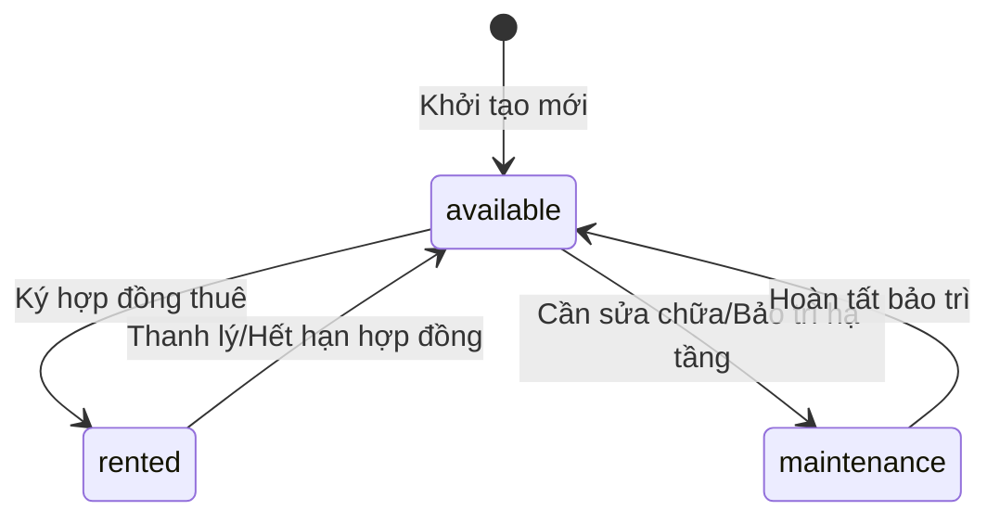
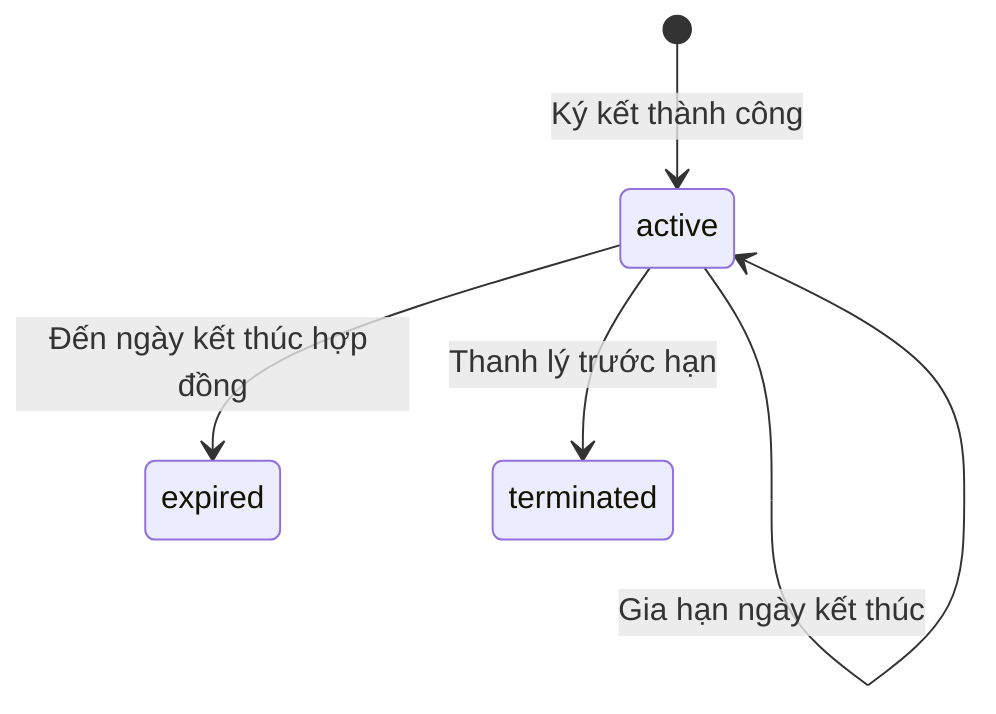
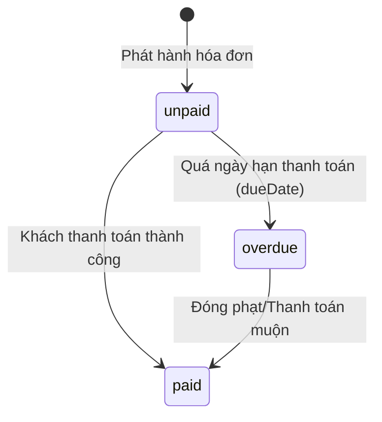
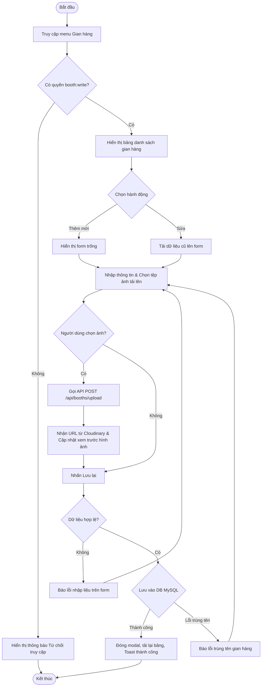
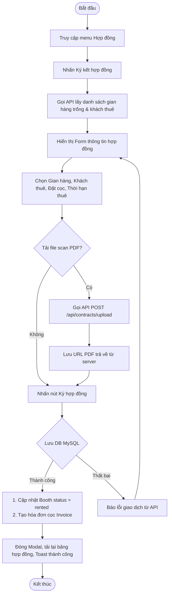
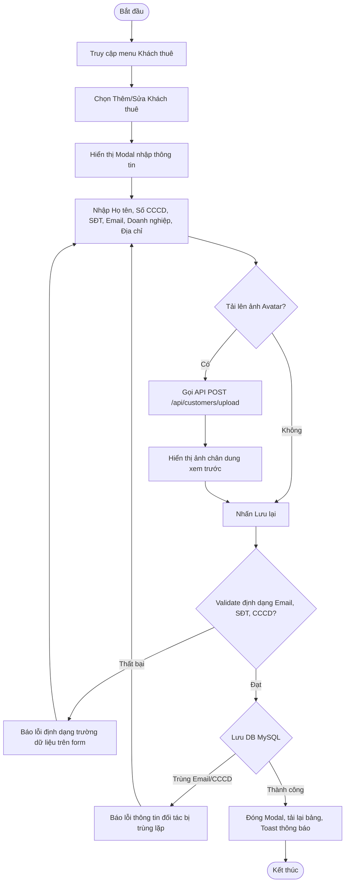
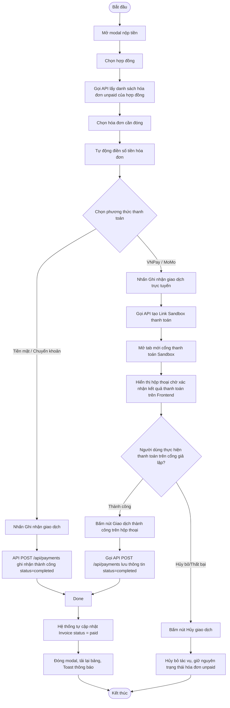

# TÀI LIỆU ĐẶC TẢ YÊU CẦU PHẦN MỀM (SRS)
## HỆ THỐNG QUẢN LÝ THUÊ GIAN HÀNG THƯƠNG MẠI

---

## PHẦN 1: GIỚI THIỆU

### 1.1. Mục đích tài liệu
Tài liệu Đặc tả Yêu cầu Phần mềm (SRS - Software Requirements Specification) này mô tả toàn bộ các yêu cầu chức năng, phi chức năng, luồng nghiệp vụ và cấu trúc dữ liệu của dự án **"Hệ thống quản lý thuê gian hàng"**. Tài liệu được biên soạn nhằm:
- Phục vụ quá trình phát triển, kiểm thử, bàn giao đồ án tốt nghiệp chuẩn doanh nghiệp.
- Làm căn cứ đối chiếu tính đúng đắn của toàn bộ các API Backend (Node.js/Express) và giao diện Frontend (React/Ant Design).
- Giúp các bên liên quan (Giảng viên hướng dẫn, Hội đồng chấm, Lập trình viên) hiểu rõ luồng nghiệp vụ vận hành hệ thống.

### 1.2. Phạm vi tài liệu
Tài liệu này bao trùm các cấu phần hệ thống bao gồm:
- **Phân hệ Quản trị & Điều hành**: Dành cho Quản trị viên (Admin), Quản lý (Manager), Nhân viên vận hành (Staff) quản lý thông tin bất động sản gian hàng, khách thuê, hợp đồng, lập hóa đơn, đối soát giao dịch và xem báo cáo doanh thu.
- **Phân hệ Khách thuê (Customer Portal)**: Dành cho Khách thuê đăng nhập tự tra cứu hợp đồng cá nhân, hóa đơn đến hạn và thực hiện thanh toán trực tuyến qua cổng mô phỏng VNPay/MoMo.
- **Cơ sở dữ liệu**: Đặc tả lược đồ thực thể quan hệ (ERD) trên cơ sở dữ liệu MySQL thông qua Prisma ORM.

### 1.3. Tổng quan ứng dụng
Hệ thống quản lý thuê gian hàng hỗ trợ tự động hóa chu kỳ vận hành cho thuê mặt bằng bán lẻ tại các trung tâm thương mại:
1. Thiết lập mặt bằng/gian hàng (Diện tích, Tầng, Khu vực, Đơn giá).
2. Quản lý thông tin hồ sơ và định danh khách thuê (Cá nhân hoặc doanh nghiệp).
3. Lập hợp đồng thuê, quản lý đặt cọc và phát hành hóa đơn định kỳ hàng tháng.
4. Xử lý thanh toán đa phương thức (Tiền mặt, Chuyển khoản, Ví điện tử trực tuyến).
5. Theo dõi công nợ, nhắc nhở quá hạn và kết xuất báo cáo doanh số đa chiều.

### 1.4. Thuật ngữ viết tắt
| STT | Từ viết tắt | Diễn giải |
| :--- | :--- | :--- |
| 1 | **SRS** | Software Requirements Specification (Đặc tả yêu cầu phần mềm) |
| 2 | **ERD** | Entity Relationship Diagram (Sơ đồ quan hệ thực thể) |
| 3 | **RBAC** | Role-Based Access Control (Kiểm soát truy cập dựa trên vai trò) |
| 4 | **JWT** | JSON Web Token (Mã xác thực trạng thái phiên đăng nhập) |
| 5 | **PMS** | Property Management System (Hệ thống quản lý bất động sản/tài sản) |
| 6 | **UUID** | Universally Unique Identifier (Mã nhận diện duy nhất toàn cầu) |
| 7 | **CRUD** | Create, Read, Update, Delete (Thêm, Đọc, Sửa, Xóa) |
| 8 | **API** | Application Programming Interface (Giao diện lập trình ứng dụng) |

---

## PHẦN 2: YÊU CẦU TỔNG THỂ

### 2.1. Sơ đồ quan hệ đối tượng (ERD)
Dưới đây là sơ đồ lược đồ quan hệ thực thể của cơ sở dữ liệu được xây dựng bằng MySQL biểu diễn dưới dạng Mermaid:

```mermaid
erDiagram
    users {
        Int id PK
        String username
        String email
        String password
        String avatar
        String status
        DateTime created_at
    }
    roles {
        Int id PK
        String name
        String description
    }
    permissions {
        Int id PK
        String name
        String description
    }
    user_roles {
        Int user_id PK, FK
        Int role_id PK, FK
    }
    role_permissions {
        Int role_id PK, FK
        Int permission_id PK, FK
    }
    booths {
        Int id PK
        String name
        Float area
        Float price
        Int floor
        String zone
        String status
        Text description
        Text images
    }
    customers {
        Int id PK
        Int user_id FK
        String name
        String email
        String phone
        String id_card
        String company
        String address
        String avatar
        String status
    }
    contracts {
        Int id PK
        String contract_code
        Int booth_id FK
        Int customer_id FK
        Float deposit
        DateTime start_date
        DateTime end_date
        String status
        String pdf_url
    }
    invoices {
        Int id PK
        String invoice_code
        Int contract_id FK
        String title
        Float amount
        DateTime due_date
        String status
        String pdf_url
        String excel_url
    }
    payments {
        Int id PK
        String payment_code
        Int contract_id FK
        Int invoice_id FK
        Float amount
        String payment_method
        DateTime payment_date
        String status
    }
    notifications {
        Int id PK
        Int user_id FK
        String title
        Text content
        Boolean is_read
        String type
    }
    logs {
        Int id PK
        Int user_id FK
        String action
        Text details
        String ip_address
    }

    users ||--o{ user_roles : "has"
    roles ||--o{ user_roles : "belongs_to"
    roles ||--o{ role_permissions : "contains"
    permissions ||--o{ role_permissions : "assigned_to"
    users ||--o| customers : "maps_to"
    users ||--o{ notifications : "receives"
    users ||--o{ logs : "triggers"
    customers ||--o{ contracts : "signs"
    booths ||--o{ contracts : "rented_by"
    contracts ||--o{ invoices : "generates"
    contracts ||--o{ payments : "paid_for"
    invoices ||--o{ payments : "clears"
```



### 2.2. Sơ đồ Use Case
Biểu diễn các tác vụ chính của các tác nhân (Actors) trong hệ thống:

```mermaid
usecaseDiagram
    actor "Ban Quản Trị (Admin/Manager)" as Admin
    actor "Khách Thuê (Customer)" as Customer

    rectangle "Hệ thống quản lý thuê gian hàng" {
        usecase "Xác thực (Đăng nhập, Đăng ký, Đổi mật khẩu)" as UC_Auth
        usecase "Quản lý gian hàng (CRUD, Upload ảnh)" as UC_Booth
        usecase "Quản lý khách thuê (CRUD)" as UC_Customer
        usecase "Ký kết & Quản lý hợp đồng (PDF, Gia hạn, Thanh lý)" as UC_Contract
        usecase "Lập hóa đơn & Xuất PDF/Excel" as UC_Invoice
        usecase "Đóng tiền & Ghi nhận thanh toán" as UC_Payment
        usecase "Thanh toán trực tuyến (VNPay/MoMo)" as UC_OnlinePay
        usecase "Xem báo cáo doanh thu & Thống kê" as UC_Report
        usecase "Phân quyền & Quản lý tài khoản" as UC_User
    }

    Admin --> UC_Auth
    Admin --> UC_Booth
    Admin --> UC_Customer
    Admin --> UC_Contract
    Admin --> UC_Invoice
    Admin --> UC_Payment
    Admin --> UC_Report
    Admin --> UC_User

    Customer --> UC_Auth
    Customer --> UC_Contract
    Customer --> UC_Invoice
    Customer --> UC_OnlinePay
```

### 2.3. Sơ đồ luồng tổng quát (Luồng nghiệp vụ ký hợp đồng và thanh toán)
Mô tả trình tự tương tác nghiệp vụ chuẩn khi có khách hàng tiến hành thuê gian hàng mới:

```mermaid
sequenceDiagram
    autonumber
    actor Admin as Nhân viên điều hành
    actor Customer as Khách thuê đối tác
    participant System as Hệ thống (Client & Server)
    database Database as Cơ sở dữ liệu MySQL

    Admin->>System: Tìm kiếm gian hàng trống (Trạng thái = available)
    System-->>Admin: Hiển thị danh sách gian hàng trống
    Admin->>System: Nhập thông tin Khách thuê & Tài liệu định danh (CCCD)
    System->>Database: Lưu thông tin Khách thuê
    Database-->>System: Phản hồi tạo thành công
    Admin->>System: Tạo hợp đồng thuê (Chọn gian hàng, Khách thuê, Tiền cọc, Ngày thuê)
    System->>Database: Đăng ký hợp đồng & Chuyển trạng thái Booth sang 'rented'
    Database-->>System: Tạo hợp đồng thành công
    Note over System: Hệ thống tự động tạo hóa đơn Tiền đặt cọc (Invoice Code: INV-DEP-*)
    System-->>Customer: Gửi email thông báo & Kích hoạt tài khoản Khách thuê
    Customer->>System: Đăng nhập & Truy cập Hóa đơn cần thanh toán
    Customer->>System: Lựa chọn thanh toán trực tuyến qua VNPay/MoMo
    System->>System: Chuyển tiếp cổng thanh toán mô phỏng (Sandbox)
    Customer->>System: Xác thực giao dịch thành công trên cổng giả lập
    System->>Database: Ghi nhận Giao dịch thành công & Đổi trạng thái hóa đơn sang 'paid'
    Database-->>System: Giao dịch được lưu vết
    System-->>Customer: Hiển thị hóa đơn đã thanh toán & Tải xuống PDF
```

### 2.4. Sơ đồ chuyển trạng thái

#### 2.4.1. Trạng thái Gian hàng (Booth)


#### 2.4.2. Trạng thái Hợp đồng (Contract)


#### 2.4.3. Trạng thái Hóa đơn (Invoice)


### 2.5. Phân quyền
Hệ thống sử dụng cơ chế **RBAC** để phân tách quyền lực giữa các nhóm người dùng:

#### 2.5.1. Phân quyền chức năng (API & Router Route Access Control)
| Quyền (Permission) | Admin | Manager | Staff | Customer |
| :--- | :---: | :---: | :---: | :---: |
| Xem gian hàng (`booth:read`) | ✔ | ✔ | ✔ | ✔ |
| Tạo/Sửa gian hàng (`booth:write`) | ✔ | ✔ | ✖ | ✖ |
| Xóa gian hàng (`booth:delete`) | ✔ | ✖ | ✖ | ✖ |
| Xem khách thuê (`customer:read`) | ✔ | ✔ | ✔ | ✖ |
| Tạo/Sửa khách thuê (`customer:write`) | ✔ | ✔ | ✔ | ✖ |
| Xóa khách thuê (`customer:delete`) | ✔ | ✖ | ✖ | ✖ |
| Xem hợp đồng (`contract:read`) | ✔ | ✔ | ✔ | Chỉ xem của mình |
| Ký mới/Gia hạn hợp đồng (`contract:write`)| ✔ | ✔ | ✔ | ✖ |
| Thanh lý hợp đồng (`contract:terminate`) | ✔ | ✔ | ✖ | ✖ |
| Xóa hợp đồng (`contract:delete`) | ✔ | ✖ | ✖ | ✖ |
| Ghi nhận thanh toán (`payment:write`) | ✔ | ✔ | ✔ | Chỉ thanh toán trực tuyến |
| Lập hóa đơn (`invoice:write`) | ✔ | ✔ | ✖ | ✖ |
| Xem báo cáo doanh thu (`report:read`) | ✔ | ✔ | ✖ | ✖ |
| Quản lý tài khoản hệ thống (`account:write`)| ✔ | ✖ | ✖ | ✖ |

#### 2.5.2. Phân quyền dữ liệu
- **Ban Quản trị (Admin, Manager, Staff)**: Được phép truy cập toàn bộ dữ liệu trên hệ thống thuộc các chi nhánh/khu vực.
- **Khách thuê (Customer)**: Khi đăng nhập hệ thống, chỉ truy cập được duy nhất thông tin của chính mình (Hồ sơ cá nhân, Danh sách Hợp đồng do mình ký, Danh sách Hóa đơn cần đóng, và Lịch sử Giao dịch thanh toán của bản thân). Hệ thống lọc tự động bằng cách so sánh `userId` trong JWT token với `user_id` liên kết trong bảng `customers`.

### 2.6. Site Map (Bản đồ phân trang ứng dụng)
Cấu trúc cây sơ đồ định tuyến trang trên giao diện Frontend:

```mermaid
graph TD
    Root[/] --> Login[/login]
    Root --> Register[/register]
    Root --> Forgot[/forgot-password]
    Root --> Reset[/reset-password]
    Root --> AdminPanel[/dashboard]
    
    AdminPanel --> Booths[/booths]
    AdminPanel --> Customers[/customers]
    AdminPanel --> Contracts[/contracts]
    AdminPanel --> Invoices[/invoices]
    AdminPanel --> Payments[/payments]
    AdminPanel --> Reports[/reports]
    AdminPanel --> Accounts[/accounts]
    AdminPanel --> Profile[/profile]
```

---

## PHẦN 3: CHỨC NĂNG

### Danh sách các chức năng hệ thống
| Mã chức năng | Tên chức năng | Phân hệ | Tác nhân (Actor) |
| :--- | :--- | :--- | :--- |
| **AUTH-01** | Đăng nhập hệ thống | Xác thực | Tất cả người dùng |
| **BOOTH-01** | Quản lý Gian hàng (CRUD & Upload ảnh) | Vận hành | Admin, Manager |
| **CUST-01** | Quản lý Khách thuê (CRUD & Upload Avatar) | Vận hành | Admin, Manager, Staff |
| **CONT-01** | Đăng ký & Ký hợp đồng thuê (Upload PDF) | Hợp đồng | Admin, Manager, Staff |
| **CONT-02** | Gia hạn & Thanh lý hợp đồng | Hợp đồng | Admin, Manager |
| **INVO-01** | Phát hành hóa đơn phí dịch vụ | Tài chính | Admin, Manager |
| **INVO-02** | Xuất hóa đơn định dạng PDF / Excel | Tài chính | Admin, Manager, Staff, Customer |
| **PAYM-01** | Ghi nhận đóng tiền tại quầy | Tài chính | Admin, Manager, Staff |
| **PAYM-02** | Thanh toán trực tuyến VNPay / MoMo | Tài chính | Customer |
| **REPO-01** | Báo cáo doanh thu & Phân tích tăng trưởng | Thống kê | Admin, Manager |
| **USER-01** | Cấu hình phân quyền nhóm vai trò người dùng | Hệ thống | Admin |

---

### 3.1. Chức năng BOOTH-01: Quản lý Gian hàng thương mại
Quản lý vòng đời gian hàng bao gồm khai báo thông tin kỹ thuật, đơn giá thuê định kỳ và cập nhật hiện trạng mặt bằng.

#### 3.1.1. Đặc tả Use Case
| Thuộc tính | Nội dung mô tả |
| :--- | :--- |
| **Use Case ID** | **BOOTH-01** |
| **Mô tả** | Người quản lý thực hiện Thêm, Sửa thông tin kỹ thuật (tầng, khu, diện tích), đơn giá và tải lên hình ảnh chụp thực tế của gian hàng. |
| **Tác nhân (Actor(s))** | Quản trị viên (Admin), Quản lý vận hành (Manager) |
| **Sự ưu tiên (Priority)**| Cao (High) |
| **Trigger** | Người quản lý truy cập mục "Gian hàng" và nhấn nút "Thêm gian hàng" hoặc biểu tượng "Sửa" trên bảng danh sách. |
| **Điều kiện cần** | Đã đăng nhập vào hệ thống với tài khoản có quyền `booth:write`. |
| **Điều kiện sau** | Thông tin gian hàng được lưu/cập nhật vào DB MySQL, trạng thái gian hàng sẵn sàng cho việc lập hợp đồng thuê mới. |
| **Luồng cơ bản** | 1. Hệ thống hiển thị danh sách gian hàng và phân trang.<br>2. Người dùng nhấn chọn "Thêm gian hàng".<br>3. Hệ thống hiển thị Modal Form yêu cầu nhập thông tin.<br>4. Người dùng nhập: Tên gian hàng, Tầng, Khu vực, Diện tích, Giá thuê.<br>5. Người dùng nhấn nút tải ảnh lên, hệ thống gọi API để đẩy file lên Cloudinary và trả về đường dẫn ảnh hiển thị xem trước.<br>6. Người dùng điền mô tả hạ tầng và nhấn nút "Lưu lại".<br>7. Hệ thống validate dữ liệu hợp lệ, lưu vào CSDL và cập nhật danh sách hiển thị, hiện Toast thông báo thành công. |
| **Luồng thay thế** | **Tại bước 3 (Chế độ Sửa)**:<br>1. Người dùng nhấn biểu tượng chiếc bút chì (Sửa) cạnh gian hàng cần chỉnh sửa.<br>2. Hệ thống tải dữ liệu hiện tại lên Form và tải danh sách ảnh cũ lên khung xem trước.<br>3. Người dùng cập nhật thông tin và tiến hành lưu lại. |
| **Luồng ngoại lệ** | - **Trùng tên gian hàng**: Hệ thống báo lỗi trùng khóa duy nhất (Unique constraint) và yêu cầu nhập lại tên khác.<br>- **Sai định dạng file ảnh/File quá 10MB**: Hệ thống chặn, báo lỗi định dạng ảnh không phù hợp và hủy tải file. |
| **Ràng buộc nghiệp vụ** | - Đơn giá thuê phải là số nguyên dương lớn hơn 1,000 VND.<br>- Diện tích phải lớn hơn 0 m².<br>- Trạng thái mặc định khi tạo mới là `available` (Còn trống). |
| **Yêu cầu phi chức năng**| - Thời gian upload hình ảnh và phản hồi giao diện không quá 3 giây.<br>- Giao diện responsive trên thiết bị Tablet và Mobile. |

#### 3.1.2. Sơ đồ luồng chi tiết


#### 3.1.3. Giao diện thiết kế (Mockup)
- **Tên trang hiển thị**: Quản lý Gian hàng thương mại.
- **Thanh tìm kiếm & Bộ lọc**: Nằm ở đầu trang gồm ô Tìm kiếm tên, Dropdown chọn Tầng (Tầng 1 - 4), Chọn Khu vực (Khu A - D), Chọn trạng thái (Còn trống, Đang thuê, Bảo trì), nút đặt lại bộ lọc và nút "Thêm gian hàng".
- **Bảng dữ liệu (Table)**: Chứa các cột thông tin kèm ảnh thu nhỏ (thumbnail) kích thước 40x40px bo góc hiển thị ảnh đầu tiên của gian hàng.
- **Hộp thoại (Modal) nhập liệu**: Thiết kế dạng bán trong suốt (glassmorphism) theo phong cách hiện đại, chứa các ô nhập liệu được tổ chức thẳng hàng bằng Antd Grid Row/Col.

#### 3.1.4. Mô tả chi tiết dữ liệu đầu vào
| Tên tiếng Việt | Tên tiếng Anh | Loại dữ liệu | Bắt buộc? | Mô tả nghiệp vụ |
| :--- | :--- | :--- | :---: | :--- |
| **Tên gian hàng** | `name` | String | Có | Định danh duy nhất của gian hàng (Ví dụ: Gian hàng A101) |
| **Trạng thái** | `status` | String (Enum) | Có | Lựa chọn giữa: `available`, `rented`, `maintenance` |
| **Vị trí Tầng** | `floor` | Number | Có | Tầng bố trí gian hàng (nhỏ nhất là tầng 1) |
| **Khu vực** | `zone` | String | Có | Phân khu trung tâm thương mại (A, B, C, D) |
| **Diện tích** | `area` | Number | Có | Diện tích đo theo mét vuông (m²) |
| **Đơn giá thuê** | `price` | Number | Có | Giá thuê niêm yết mỗi tháng (VND) |
| **Hình ảnh** | `images` | File / String | Không | Tệp tin ảnh dạng JPG/PNG được upload để lấy chuỗi đường dẫn URL |
| **Mô tả** | `description` | Text | Không | Đặc điểm hạ tầng, hướng tiếp cận gian hàng |

---

### 3.2. Chức năng CONT-01: Ký kết hợp đồng thuê gian hàng
Thực hiện thiết lập thỏa thuận pháp lý cho thuê gian hàng giữa đại diện ban quản lý và khách thuê đối tác.

#### 3.2.1. Đặc tả Use Case
| Thuộc tính | Nội dung mô tả |
| :--- | :--- |
| **Use Case ID** | **CONT-01** |
| **Mô tả** | Người quản lý thực hiện lập hợp đồng cho thuê mặt bằng thương mại, chọn gian hàng trống, chọn khách thuê, thiết lập tiền đặt cọc, thời hạn thuê và tải lên bản scan hợp đồng PDF đã ký. |
| **Tác nhân (Actor(s))** | Quản trị viên (Admin), Quản lý vận hành (Manager), Nhân viên (Staff) |
| **Sự ưu tiên (Priority)**| Cao (High) |
| **Trigger** | Người dùng nhấp chọn nút "Ký kết hợp đồng" tại phân hệ Hợp đồng. |
| **Điều kiện cần** | Đăng nhập với quyền `contract:write`. Cần tồn tại ít nhất 1 gian hàng ở trạng thái `available` và khách thuê trong hệ thống. |
| **Điều kiện sau** | - Hợp đồng mới được tạo ra ở trạng thái `active`.<br>- Trạng thái của gian hàng đổi từ `available` sang `rented`.<br>- Hệ thống tự phát hành hóa đơn tiền cọc `INV-DEP-*` ở trạng thái `unpaid` (Chờ đóng tiền cọc). |
| **Luồng cơ bản** | 1. Hệ thống mở Modal thiết lập hợp đồng.<br>2. Hệ thống gọi danh sách các gian hàng có trạng thái trống và danh sách đối tác khách thuê để đổ vào các ô Selectbox.<br>3. Người dùng chọn: Gian hàng, Đối tác khách thuê.<br>4. Người dùng nhập: Ngày bắt đầu và ngày kết thúc (sử dụng RangePicker), Số tiền cọc.<br>5. Người dùng nhấn nút tải bản scan PDF, hệ thống gọi API `/api/contracts/upload` để gửi file lên Cloudinary dạng Raw File và trả về đường dẫn PDF.<br>6. Người dùng kiểm tra lại thông tin và bấm nút "Ký hợp đồng".<br>7. Hệ thống tự động tạo mã hợp đồng theo quy tắc cấu trúc mã, lưu DB, chuyển trạng thái Booth sang `rented`, lập hóa đơn cọc, hiện Toast báo thành công. |
| **Luồng thay thế** | Không có luồng thay thế. Thao tác ký kết hợp đồng chỉ thực hiện 1 lần và không được sửa các trường cốt lõi sau khi tạo nhằm đảm bảo tính pháp lý. |
| **Luồng ngoại lệ** | - **Quên tải PDF**: Hệ thống vẫn chấp nhận cho lưu hợp đồng không có PDF (bổ sung bản scan sau).<br>- **Ngày thuê không logic**: Chọn ngày kết thúc trước ngày bắt đầu, hệ thống báo lỗi không hợp lệ. |
| **Ràng buộc nghiệp vụ** | - Mã hợp đồng tự động sinh có cấu trúc: `HD-{Năm_bắt_đầu}-{Tên_gian_hàng_viết_hoa_không_dấu}-{Mã_số_ngẫu_nhiên_4_số}`.<br>- Tiền cọc thế chân bắt buộc phải nhập và lớn hơn hoặc bằng 0.<br>- Thời hạn hợp đồng tối thiểu là 1 tháng. |
| **Yêu cầu phi chức năng**| File PDF scan tải lên không được vượt quá 10MB để tối ưu dung lượng đám mây. |

#### 3.2.2. Sơ đồ luồng chi tiết


#### 3.2.3. Giao diện thiết kế (Mockup)
- **Bảng danh sách hợp đồng**: Gồm các cột: Mã hợp đồng, Gian hàng, Khách thuê, Tiền đặt cọc, Ngày bắt đầu, Ngày hết hạn, Trạng thái (được gán thẻ Tag màu sắc: Hoạt động - màu xanh, Đã thanh lý - màu xám, Hết hạn - màu đỏ).
- **Mã hợp đồng tích hợp file đính kèm**: Cột "Mã hợp đồng" hiển thị tên mã in đậm kèm theo biểu tượng tập tin `📄` nhỏ kế bên. Người dùng nhấp vào biểu tượng này sẽ mở tab trình duyệt mới xem trực tiếp file PDF hợp đồng.
- **Hộp thoại lập hợp đồng**: Sử dụng component Select có chức năng tìm kiếm trực tiếp tên đối tác/mã đối tác để chọn nhanh trong danh sách hàng trăm khách thuê.

#### 3.2.4. Mô tả chi tiết dữ liệu đầu vào
| Tên tiếng Việt | Tên tiếng Anh | Loại dữ liệu | Bắt buộc? | Mô tả nghiệp vụ |
| :--- | :--- | :--- | :---: | :--- |
| **Chọn gian hàng** | `boothId` | Number (ID) | Có | ID của gian hàng được chọn thuê (phải có status = available) |
| **Chọn khách thuê**| `customerId` | Number (ID) | Có | ID khách hàng đại diện ký kết |
| **Thời hạn thuê** | `dates` | Date Array | Có | Gồm 2 giá trị: Ngày bắt đầu (`startDate`) và Ngày kết thúc (`endDate`) |
| **Tiền đặt cọc** | `deposit` | Number | Có | Tiền ký quỹ đảm bảo thực hiện hợp đồng (VND) |
| **Bản scan PDF** | `pdf` | File / String | Không | Tập tin PDF scan bản cứng hợp đồng đã ký đóng dấu của hai bên |

---

### 3.3. Chức năng CUST-01: Quản lý Hồ sơ khách thuê
Khai báo và theo dõi thông tin lý lịch cá nhân hoặc thông tin pháp nhân doanh nghiệp đối tác thuê mặt bằng.

#### 3.3.1. Đặc tả Use Case
| Thuộc tính | Nội dung mô tả |
| :--- | :--- |
| **Use Case ID** | **CUST-01** |
| **Mô tả** | Người vận hành thực hiện CRUD thông tin liên hệ của khách thuê, số định danh cá nhân (CCCD) hoặc tên pháp nhân công ty của đối tác. |
| **Tác nhân (Actor(s))** | Quản trị viên (Admin), Quản lý (Manager), Nhân viên vận hành (Staff) |
| **Sự ưu tiên (Priority)**| Trung bình (Medium) |
| **Trigger** | Người dùng mở phân hệ "Khách thuê" và chọn tạo mới hoặc cập nhật hồ sơ khách thuê. |
| **Điều kiện cần** | Có quyền tác vụ `customer:write`. |
| **Điều kiện sau** | Dữ liệu khách thuê được cập nhật. Nếu khách thuê được liên kết với một tài khoản người dùng (`userId`), tài khoản đó sẽ thừa hưởng quyền truy cập cổng Customer Portal để tra cứu dịch vụ. |
| **Luồng cơ bản** | 1. Hệ thống hiển thị danh sách hồ sơ khách thuê hiện tại.<br>2. Người dùng nhấn nút "Thêm khách thuê".<br>3. Hệ thống mở Modal nhập hồ sơ.<br>4. Người dùng nhập: Họ tên khách thuê, Số CCCD, Địa chỉ email, Số điện thoại, Tên công ty/doanh nghiệp (nếu có), Địa chỉ thường trú.<br>5. Người dùng nhấn chọn tải ảnh đại diện cá nhân, hệ thống gọi API để đưa file lên thư mục Cloudinary lưu trữ và hiển thị ảnh xem trước.<br>6. Nhấn nút "Lưu lại". Hệ thống validate định dạng email, số điện thoại, số thẻ căn cước công dân.<br>7. Lưu CSDL thành công, tải lại dữ liệu bảng và hiện thông báo. |
| **Luồng thay thế** | **Sửa thông tin khách thuê**: Người dùng nhấp vào biểu tượng sửa tại hàng thông tin khách hàng, chỉnh sửa các trường liên lạc bị thay đổi và nhấn lưu lại. |
| **Luồng ngoại lệ** | **Email/CCCD trùng lặp**: Hệ thống báo lỗi "Email hoặc số CCCD này đã tồn tại trên hệ thống" và từ chối lưu bản ghi mới. |
| **Ràng buộc nghiệp vụ** | - Địa chỉ Email phải đúng định dạng kiểm tra (`test@domain.com`).<br>- Số điện thoại và CCCD chỉ được chứa các ký tự số, số CCCD bắt buộc dài đúng 12 chữ số (đối với Việt Nam). |
| **Yêu cầu phi chức năng**| Ảnh đại diện tự động nén kích thước về tối đa 500x500px trước khi tải lên để tiết kiệm băng thông truyền tải. |

#### 3.3.2. Sơ đồ luồng chi tiết


#### 3.3.3. Giao diện thiết kế (Mockup)
- **Danh sách bảng**: Cột thông tin khách hàng được hiển thị kết hợp gồm một Avatar tròn (Ant Design `<Avatar>`) nằm bên cạnh Tên khách thuê (in đậm) và địa chỉ Email bên dưới (chữ nhỏ màu xám).
- **Mục điền ảnh**: Thiết kế ô tròn có biểu tượng dấu cộng `+` và nhãn "Tải lên" ở cuối form, hỗ trợ kéo thả ảnh trực tiếp từ máy tính để thực hiện upload.

#### 3.3.4. Mô tả chi tiết dữ liệu đầu vào
| Tên tiếng Việt | Tên tiếng Anh | Loại dữ liệu | Bắt buộc? | Mô tả nghiệp vụ |
| :--- | :--- | :--- | :---: | :--- |
| **Họ và tên đối tác** | `name` | String | Có | Họ tên đầy đủ của người đại diện ký thuê |
| **Số CCCD / Hộ chiếu**| `idCard` | String | Có | Mã căn cước công dân định danh cá nhân (12 chữ số) |
| **Địa chỉ Email** | `email` | String | Có | Email nhận các thông báo biên lai hóa đơn và thông tin từ hệ thống |
| **Số điện thoại** | `phone` | String | Có | Số điện thoại liên hệ trực tiếp |
| **Doanh nghiệp** | `company` | String | Không | Tên công ty pháp nhân sở hữu gian hàng (nếu có) |
| **Địa chỉ thường trú** | `address` | String | Không | Địa chỉ hộ khẩu thường trú hoặc trụ sở công ty |
| **Hình ảnh đại diện** | `avatar` | File / String | Không | Tệp ảnh chân dung khách hàng |

---

### 3.4. Chức năng PAYM-02: Thanh toán trực tuyến hóa đơn công nợ
Cung cấp khả năng thanh toán tiện lợi cho khách thuê thông qua các cổng thanh toán điện tử trực tuyến được kết nối mô phỏng sandbox.

#### 3.4.1. Đặc tả Use Case
| Thuộc tính | Nội dung mô tả |
| :--- | :--- |
| **Use Case ID** | **PAYM-02** |
| **Mô tả** | Khách thuê hoặc nhân viên lựa chọn thanh toán hóa đơn công nợ của hợp đồng bằng hình thức trực tuyến qua cổng VNPay hoặc Ví điện tử MoMo. |
| **Tác nhân (Actor(s))** | Khách thuê (Customer), Nhân viên vận hành (Staff) |
| **Sự ưu tiên (Priority)**| Cao (High) |
| **Trigger** | Người dùng mở Modal ghi nhận thanh toán, chọn phương thức VNPay hoặc MoMo. |
| **Điều kiện cần** | Hợp đồng của khách thuê có hóa đơn ở trạng thái `unpaid` (Chưa thanh toán) hoặc `overdue` (Quá hạn). |
| **Điều kiện sau** | - Giao dịch thanh toán được lưu trữ thành công trong DB dưới trạng thái `completed`.<br>- Hóa đơn liên kết chuyển trạng thái sang `paid` (Đã thanh toán). |
| **Luồng cơ bản** | 1. Người dùng mở Modal đóng tiền phí thuê mặt bằng.<br>2. Chọn Hợp đồng liên quan, hệ thống tự hiển thị danh sách các Hóa đơn chưa thanh toán tương ứng của hợp đồng đó.<br>3. Người dùng chọn Hóa đơn cần nộp tiền. Hệ thống tự động điền số tiền cần đóng dựa trên hóa đơn.<br>4. Tại mục Phương thức thanh toán, chọn "VNPay (Giả lập trực tuyến)" hoặc "Ví MoMo (Giả lập trực tuyến)".<br>5. Bấm nút "Ghi nhận giao dịch". Hệ thống gọi API Backend (`/api/payments/vnpay-url` hoặc `/api/payments/momo-url`).<br>6. Backend tạo liên kết thanh toán mô phỏng cổng sandbox và trả về. Frontend mở liên kết này tại một Tab trình duyệt mới.<br>7. Hệ thống hiển thị hộp thoại xác nhận trên Frontend thông báo đang xử lý giao dịch trực tuyến.<br>8. Người dùng thực hiện thao tác thanh toán giả lập trên tab mới thành công, quay lại tab chính và bấm "Giao dịch thành công".<br>9. Hệ thống gửi yêu cầu ghi nhận thanh toán với trạng thái `completed`, lưu DB, đổi trạng thái hóa đơn sang `paid`, Toast thành công. |
| **Luồng thay thế** | Người dùng chọn phương thức "Nộp tiền mặt tại quầy" hoặc "Chuyển khoản Internet Banking". Hệ thống sẽ lưu trực tiếp giao dịch thành công mà không cần chuyển tiếp qua tab cổng thanh toán giả lập. |
| **Luồng ngoại lệ** | Khách hàng đóng tab thanh toán trực tuyến hoặc bấm nút hủy giao dịch, hệ thống ghi nhận trạng thái thanh toán là `failed` hoặc hủy bỏ giao dịch ghi nhận. |
| **Ràng buộc nghiệp vụ** | - Số tiền thanh toán trực tuyến phải khớp hoàn toàn với số tiền phải thanh toán ghi trên hóa đơn được chọn.<br>- Giao dịch chỉ được lưu thành công khi được xác nhận thành công. |
| **Yêu cầu phi chức năng**| Cổng thanh toán phải bảo mật giao dịch, bảo toàn số tiền mã hóa và thực hiện chuyển hướng phản hồi trong vòng 5 giây. |

#### 3.4.2. Sơ đồ luồng chi tiết


#### 3.4.3. Giao diện thiết kế (Mockup)
- **Modal nộp tiền**: Thiết kế đơn giản gồm các trường Selectbox liên kết động. Khi chọn Hợp đồng, danh sách hóa đơn sẽ được lọc tự động mà không cần tải lại trang.
- **Thanh toán trực tuyến**: Khi chọn cổng VNPay/MoMo, nút bấm đổi tên thành "Chuyển tiếp cổng trực tuyến" kèm icon kết nối để cảnh báo người dùng chuẩn bị mở tab mới.

#### 3.4.4. Mô tả chi tiết dữ liệu đầu vào
| Tên tiếng Việt | Tên tiếng Anh | Loại dữ liệu | Bắt buộc? | Mô tả nghiệp vụ |
| :--- | :--- | :--- | :---: | :--- |
| **Chọn hợp đồng** | `contractId` | Number (ID) | Có | ID hợp đồng thuê phát sinh giao dịch đóng tiền |
| **Chọn hóa đơn** | `invoiceId` | Number (ID) | Không | ID hóa đơn đóng tiền phí. Để trống nếu là đóng tiền cọc lúc lập hợp đồng |
| **Số tiền nộp** | `amount` | Number | Có | Số tiền đóng thực tế (VND) |
| **Ngày thanh toán**| `paymentDate` | Date String | Có | Ngày giờ giao dịch (mặc định lấy thời gian hiện tại) |
| **Phương thức** | `paymentMethod`| String (Enum) | Có | Lựa chọn: `cash` (Tiền mặt), `bank_transfer` (Chuyển khoản), `vnpay` (VNPay), `momo` (MoMo) |

---

## PHẦN 4: CÁC COMPONENT, THÔNG BÁO VÀ CẢNH BÁO

Hệ thống thiết lập các mẫu thông báo, cảnh báo và thành phần giao diện thống nhất như sau:

### 4.1. Mẫu thông báo trạng thái (Toast Notification)
Sử dụng thư viện thông báo của Ant Design (`message` và `notification` global) hiển thị ở góc trên bên phải màn hình:
- **Thông báo Thành công (Success)**: Nền xanh lá nhạt, biểu tượng tích xanh. Dùng khi: đăng nhập thành công, ký hợp đồng thành công, thanh toán thành công, cập nhật thông tin thành công.
- **Thông báo Thất bại (Error)**: Nền đỏ nhạt, biểu tượng dấu nhân màu đỏ. Dùng khi: sai mật khẩu đăng nhập, trùng lặp mã duy nhất trong cơ sở dữ liệu, lỗi tải file quá dung lượng cho phép.
- **Cảnh báo (Warning)**: Nền vàng nhạt, biểu tượng dấu chấm than. Dùng khi: hóa đơn quá hạn, hợp đồng sắp hết hạn trong vòng 30 ngày.

### 4.2. Mẫu hộp thoại xác nhận (Confirmation Dialog)
Áp dụng đối với các tác vụ có nguy cơ ảnh hưởng lớn tới dữ liệu như xóa hoặc thanh lý hợp đồng:
- **Xác nhận xóa (Delete Confirmation)**: Hiển thị Modal tiêu đề màu đỏ, nội dung cảnh báo "Hành động này sẽ xóa vĩnh viễn dữ liệu và không thể hoàn tác. Bạn có chắc chắn?". Có 2 nút lựa chọn: "Xóa" (Màu đỏ - nguy hiểm) và "Hủy" (Màu xám).
- **Xác nhận thanh lý hợp đồng (Termination Confirmation)**: Nội dung cảnh báo "Hợp đồng sẽ kết thúc trước thời hạn và giải phóng gian hàng sang trạng thái trống. Bạn có chắc chắn?". Nút lựa chọn: "Thanh lý" (Màu vàng/cam) và "Hủy".

### 4.3. Các Component UI tiêu chuẩn
Toàn bộ dự án áp dụng hệ thống thiết kế đồng bộ từ các component của Ant Design kết hợp tùy biến phong cách Glassmorphism:
- **Bảng dữ liệu (`<Table>`)**: Tích hợp phân trang tự động ở chân bảng, hỗ trợ thanh hiển thị tải dữ liệu (Loading/Spinning) che phủ khi dữ liệu đang được truy vấn từ API.
- **Bộ lọc (`<Select>`)**: Hỗ trợ khả năng tìm kiếm (Searchable Select), hiển thị nhãn xóa nhanh (AllowClear).
- **Bộ chọn thời gian (`<DatePicker>`)**: Hiển thị lịch tiếng Việt trực quan, tự động định dạng hiển thị ngày `DD/MM/YYYY`.

---

## PHẦN 5: LINK ISSUE (QUẢN LÝ DỰ ÁN TRÊN JIRA)

Các đầu việc phát triển hệ thống được quản lý và theo dõi thông qua các thẻ yêu cầu (Issue) trên Jira như bảng ánh xạ dưới đây:

| Mã Issue trên Jira | Tên đầu việc phát triển (Issue Title) | Trạng thái | Tệp mã nguồn liên quan |
| :--- | :--- | :--- | :--- |
| **BRMS-01** | Thiết lập Cơ sở dữ liệu và Prisma Client | Done | [schema.prisma](file:///e:/phong/server/prisma/schema.prisma) |
| **BRMS-02** | Phát triển API xác thực người dùng JWT | Done | [auth.service.ts](file:///e:/phong/server/src/services/auth.service.ts) |
| **BRMS-03** | Xây dựng chức năng đăng nhập, đăng ký ở Frontend | Done | [Login.tsx](file:///e:/phong/client/src/pages/auth/Login.tsx) |
| **BRMS-04** | Viết Middleware phân quyền RBAC ở Backend | Done | [rbac.ts](file:///e:/phong/server/src/middlewares/rbac.ts) |
| **BRMS-05** | Thiết lập Dashboard tổng quan và Biểu đồ thống kê | Done | [Dashboard.tsx](file:///e:/phong/client/src/pages/dashboard/Dashboard.tsx) |
| **BRMS-06** | Phát triển CRUD và Tìm kiếm Bộ lọc Gian hàng | Done | [Booths.tsx](file:///e:/phong/client/src/pages/booths/Booths.tsx) |
| **BRMS-07** | Tải lên hình ảnh gian hàng thông qua Cloudinary | Done | [booth.service.ts](file:///e:/phong/server/src/services/booth.service.ts) |
| **BRMS-08** | Quản lý khách thuê và Upload ảnh đại diện đối tác | Done | [Customers.tsx](file:///e:/phong/client/src/pages/customers/Customers.tsx) |
| **BRMS-09** | Ký kết hợp đồng và Upload tài liệu PDF scan hợp đồng | Done | [Contracts.tsx](file:///e:/phong/client/src/pages/contracts/Contracts.tsx) |
| **BRMS-10** | Tích hợp tính năng gia hạn và thanh lý hợp đồng thuê | Done | [contract.service.ts](file:///e:/phong/server/src/services/contract.service.ts) |
| **BRMS-11** | Quản lý phát hành hóa đơn dịch vụ hàng tháng | Done | [Invoices.tsx](file:///e:/phong/client/src/pages/invoices/Invoices.tsx) |
| **BRMS-12** | Xuất hóa đơn định dạng PDF và Excel (CSV) | Done | [invoice.service.ts](file:///e:/phong/server/src/services/invoice.service.ts) |
| **BRMS-13** | Tích hợp cổng thanh toán trực tuyến mô phỏng VNPay/MoMo | Done | [Payments.tsx](file:///e:/phong/client/src/pages/payments/Payments.tsx) |
| **BRMS-14** | Thiết lập chế độ giao diện tối (Dark Mode) toàn cục | Done | [themeSlice.ts](file:///e:/phong/client/src/redux/slices/themeSlice.ts) |
| **BRMS-15** | Kiểm thử, khắc phục lỗi TypeScript và tối ưu hóa hệ thống | Done | [App.tsx](file:///e:/phong/client/src/App.tsx) |
